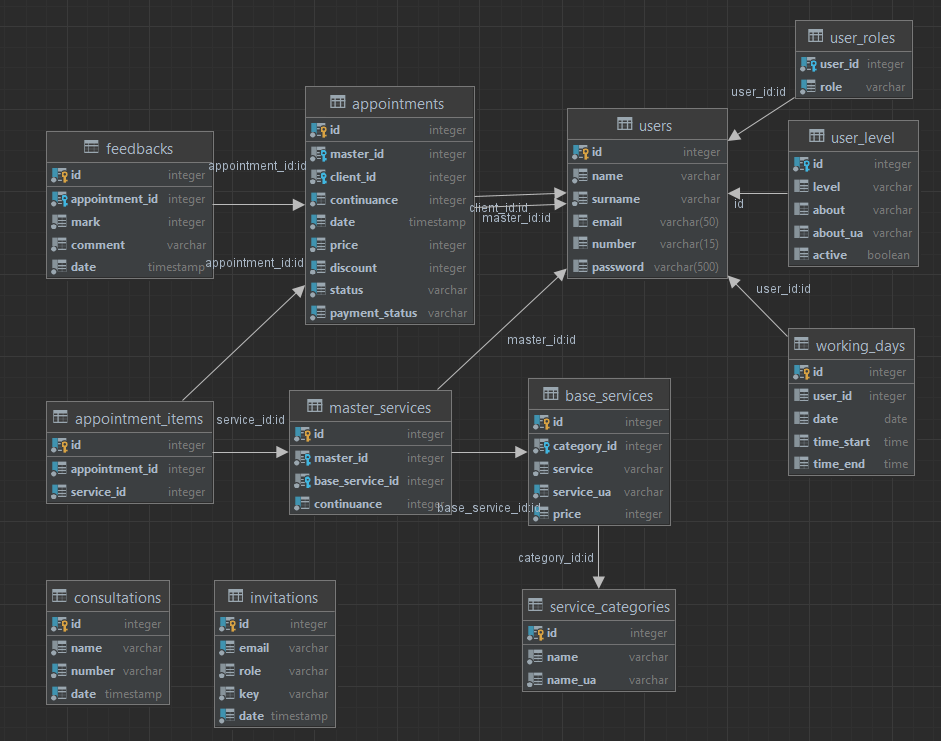

## Java Online Program (Summer 2022)

Final project "Beauty Salon"

# Task:

> The system implements the work schedule of beauty salon employees.
> There are roles: _Guest, Client, Administrator, Hairdresser_.
> 
The guest can see the catalog of masterServices and the list of hairdressers 
> taking into account sorting: - by the name; - by rating. 
> Can filter: - by certain hairdresser; - by masterServices. 

> The client (authorized user) can sign up for a specific service provided by the hairdresser and for a specific time slot. 
> The administrator can: - view customer orders and change the selected time slot; - cancel order; - accept payment for the service. 
> The hairdresser sees his schedule (busy and free time slots) and marks the execution of the order. 
> After providing masterServices, the Client leaves mark. 
> 
The offer to leave mark comes to the Client's e-mail the day after the service is provided. 

#### Restrictions:

- Do not use ORM and MVC frameworks;
- The use of templates must be justified

# Database schema

# Test data:

### Admin login:
Email: _admin@gmail.com_
Password: _password_

### Client login:
Email: _client@gmail.com_
Password: _password_

### Master login:
Email: _master@gmail.com_
Password: _password_

# Usage
### Guest
As a guest, you can browse the catalog of master services and see the list of hairdressers sorted by name or
rating. You can also filter the list by a specific hairdresser or master service.

To access these features, simply navigate to the home page of the application.

### Client 
As a client, you can sign up for a specific service provided by a hairdresser and book a specific time slot. To
do this, you must first create an account and log in.

Once you are logged in, you can browse the catalog of master services and select a hairdresser and service that you are
interested in. You can then view the available time slots and select one that works for you.

After booking a service, you can view your upcoming appointments and make changes to them if needed. You can also view
your appointment history and leave feedback on the service that you received.

### Administrator
As an administrator, you have access to all of the features available to clients, as well as additional
features for managing customer orders.

You can view all customer orders and make changes to the selected time slot if necessary. You can also cancel orders and
accept payments for services rendered.

### Hairdresser 
As a hairdresser, you can view your schedule and see which time slots are available and which ones are
already booked. You can also mark the execution of an order once you have provided the service.

After providing a service, a request to leave feedback will be sent to the client's email the following day.

To access these features, log in as a hairdresser and navigate to the appropriate pages in the application.

# Project Architecture and Design Patterns
This project follows the Model-View-Controller (MVC) architecture pattern. The model represents the data and 
the business logic of the application, the view represents the user interface, and the controller acts as an 
intermediary between the model and the view, handling user input and updating the view based on changes in the model.

In addition to MVC, the project also implements the Front Controller pattern using a Controller class that handles all 
incoming requests and forwards them to the appropriate handlers. This helps to centralize control and improve 
the overall structure of the application.

The command folder in the project follows the Command pattern. It contains classes that represent specific 
actions or commands that can be executed by the application. Each command is encapsulated in a separate class, 
which helps to improve the modularity and maintainability of the codebase. The Controller class uses these commands 
to perform the necessary actions based on user input.

# Used technologies
### Database Connectivity
- Apache Database Connection Pool
- JDBC
- PostgreSQL
### Logging
- Log4j2
### Security
- Jasypt
### Web
- Jakarta Servlet 4.0.4
### Testing
- JUnit 5
- Mockito
### Utility
- Lombok
